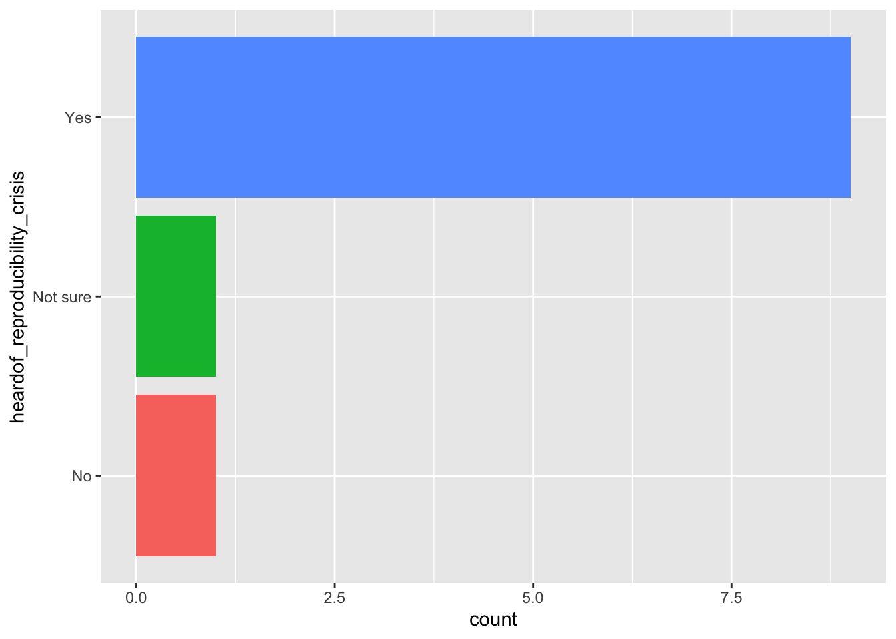
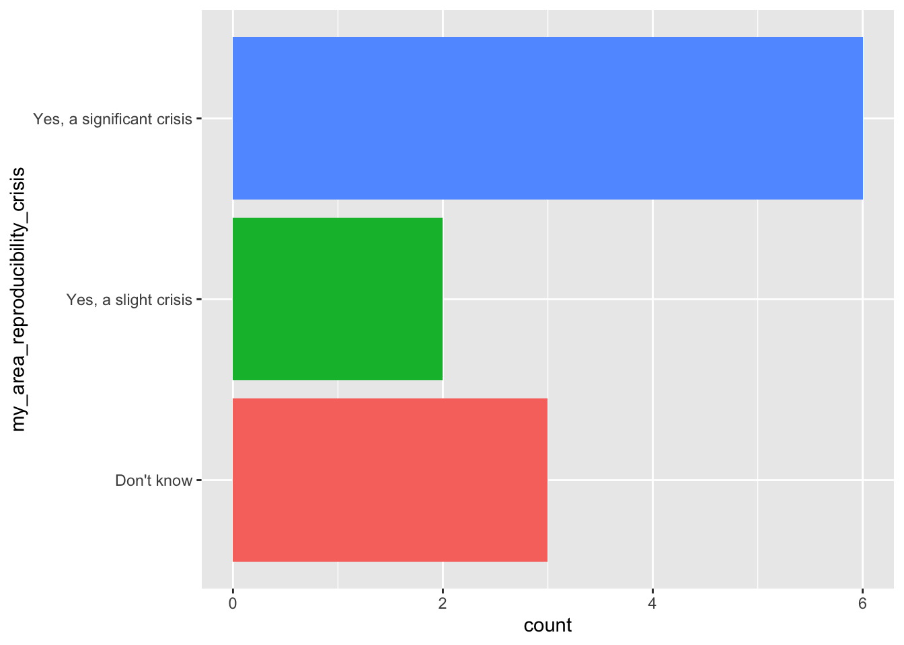
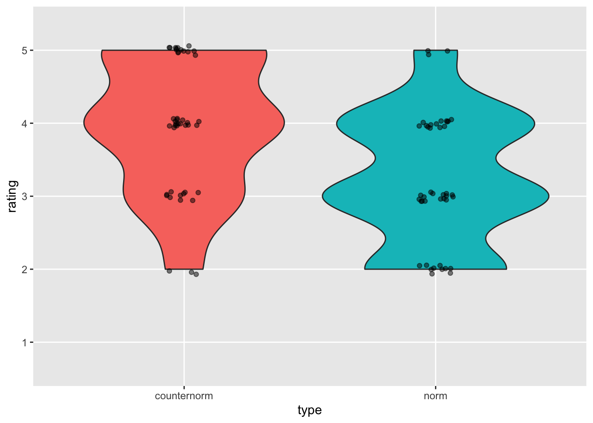
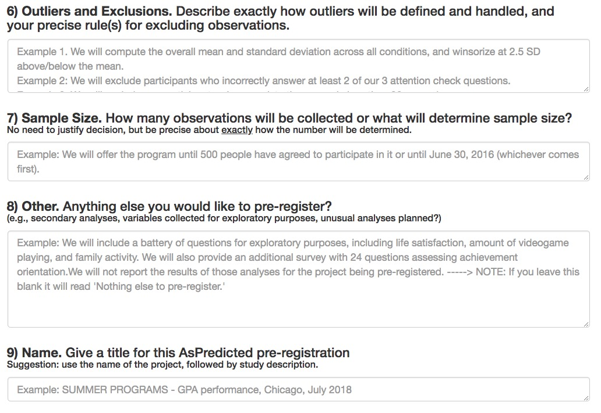

```{r setup, include=FALSE}
knitr::opts_chunk$set(echo = FALSE, warning = FALSE, 
                      message = FALSE,
                      fig.align = "center",
                      out.width = "75%")
```

## Acknowledgements

- Thank you to NICHD, NIMH, NIDA, NIH OD, NSF, the Alfred P. Sloan Foundation, the James S. McDonnell Foundation, the LEGO Foundation, and the John S. Templeton Foundation

---

<div class="centered">


</br>

</div>

<!-- Gilmore photo biography -->

## Agenda

- Prelude
- The 4 R's
- Norms and counternorms
- Toward a more robust science
- Tools for reproducible science
- Your open science future

# Prelude {data-background=#290af2}

---

```{r video-nyu-data-sharing-snafu, fig.cap="[[@NYU_Health_Sciences_Library2013-gp]](https://www.youtube.com/watch?v=66oNv_DJuPc)"}
knitr::include_url("https://www.youtube.com/embed/66oNv_DJuPc")
```

## What proportion of findings in the published scientific literature (in the fields you care about) are *actually true*?

---

- 100%
- 90%
- 70%
- 50%
- 30%

## How do we define what "*actually true*" means?

## Is there a reproducibility crisis in science?

>- Yes, a significant crisis
>- Yes, a slight crisis
>- No crisis
>- Don't know

---

```{r, out.width="600px", fig.cap="[[@baker_1500_2016]](http://doi.org/10.1038/533452a)"}
knitr::include_graphics("http://www.nature.com/polopoly_fs/7.36716.1469695923!/image/reproducibility-graphic-online1.jpeg_gen/derivatives/landscape_630/reproducibility-graphic-online1.jpeg")
```

---

```{r, out.height = "80%", fig.cap="Have you heard of the 'reproducibility crisis' in science?"}

```

[Cleaning & plotting code](survey.html)

---

```{r, fig.cap="Is there a reproducibility crisis in your area of research?"}

```

[Cleaning & plotting code](survey.html)

---

<!-- Have you failed to reproduce an analysis from your lab or someone else's? -->
```{r, fig.cap="[[@baker_1500_2016]](http://doi.org/10.1038/533452a)"}
knitr::include_graphics("http://www.nature.com/polopoly_fs/7.36718.1464174471!/image/reproducibility-graphic-online3.jpg_gen/derivatives/landscape_630/reproducibility-graphic-online3.jpg")
```

## Does this surprise you? Why or why not?

---

<!-- What factors contribute to irreproducible research? -->
```{r, fig.cap="[[@baker_1500_2016]](http://doi.org/10.1038/533452a)"}
knitr::include_graphics("http://www.nature.com/polopoly_fs/7.36719.1464174488!/image/reproducibility-graphic-online4.jpg_gen/derivatives/landscape_630/reproducibility-graphic-online4.jpg")
```

# The 4 R's {data-background=#290af2}

---

```{r gennetian-table-01, out.width="100%", fig.cap="Table 1 from [[@Gennetian2022-us]](https://doi.org/10.1146/annurev-devpsych-120920-042335)"}
knitr::include_graphics("img/gennetian-etal-2022-table-01.png")
```

---

> "...**Reproducibility** refers to testing the reliability of a prior finding using the same data and the same analysis strategy (Natl. Acad. Sci. Eng. Med. 2019)...In principle, all reported evidence should be reproducible. If someone applies the same analysis to the same data, the same result should occur..."
>
> -- [[@Nosek2022-hv]](https://doi.org/10.1146/annurev-psych-020821-114157)

## *Methods* reproducibility

- [@goodman_what_2016](http://doi.org/10.1126/scitranslmed.aaf5027)
- Enough details about materials & methods recorded (& reported)
- Same results with same materials & methods
- Example: [@Artner2021-qg](http://dx.doi.org/10.1037/met0000365).

---

<!-- Hit by a bus -->
```{r}
knitr::include_graphics("http://lh6.ggpht.com/_KVa1Tk_k1BU/TTjL-RSY_eI/AAAAAAAABtg/VQIfae1_wtQ/hit_thumb%5B3%5D.jpg?imgmax=800")
```

---

> "A **process reproducibility failure** occurs when the original analysis cannot be repeated because of the unavailability of data, code, information needed to recreate the code, or necessary software or tools."
>
> -- [@Nosek2022-hv](https://doi.org/10.1146/annurev-psych-020821-114157)

## *Results* reproducibility  

- [@goodman_what_2016](http://doi.org/10.1126/scitranslmed.aaf5027)
- Same results from independent study
- Examples: [@Camerer2018-tr; @collaboration_estimating_2015; @Whitt2022-uf]

## *Inferential* reproducibility

- [@goodman_what_2016](http://doi.org/10.1126/scitranslmed.aaf5027)
- Same inferences from one or more studies or reanalyses
- Highly reliable effects

## A 5th 'R'

> "...**Robustness** refers to testing the reliability of a prior finding using the same data and a different analysis strategy..."
>
> -- [@Nosek2022-hv](https://doi.org/10.1146/annurev-psych-020821-114157)

- Examples: [@Botvinik-Nezer2020-wr; @Silberzahn2018-st]
 
# Scientific integrity, norms, & counternorms {data-background=#290af2}

---

> "...I’m talking about a specific, *extra type of integrity* that is not lying, but *bending over backwards to show how you’re maybe wrong*, that you ought to do when acting as a scientist. And this is our responsibility as scientists, certainly to other scientists, and I think to laymen."
>
> -- [@Feynman1974-ld](https://calteches.library.caltech.edu/51/2/CargoCult.htm)

---

> "The first principle is that *you must not fool yourself—and you are the easiest person to fool*.  So you have to be very careful about that.  After you’ve not fooled yourself, it’s easy not to fool other scientists.  You just have to be honest in a conventional way after that."
>
> -- [@Feynman1974-ld](https://calteches.library.caltech.edu/51/2/CargoCult.htm)

## [Robert Merton (1942)](https://www.amazon.com/Sociology-Science-Theoretical-Empirical-Investigations/dp/0226520927) and scientific norms

- **universalism**: scientific validity is independent of sociopolitical status/personal attributes of its participants
- **communalism**: common ownership of scientific goods (intellectual property)
- **disinterestedness**: scientific institutions benefit a common scientific enterprise, not specific individuals
- **organized skepticism**: claims should be exposed to critical scrutiny before being accepted

## How widely do scientists follow the norms?

- Among NYU Steinhardt grads polled in January 2023
- [Cleaning & plotting code](survey.html)
- [Comparison with Penn State PSYCH 490 students](https://psu-psychology.github.io/psych-490-reproducibility-2023-spring-notes/survey_01_results.html)
- [Questions asked](https://psu-psychology.github.io/psych-490-reproducibility-2023-spring-notes/survey_01_results.html#questions-asked)

---

```{r adherence-to-norms, fig.cap="1: 'not at all', 5: 'a great deal'"}

```

---

```{r norms-counternorms}

```

---

```{r, out.width="90%"}
knitr::include_graphics("https://www.rd.com/wp-content/uploads/2017/02/01-How-Bad-is-it-to-Share-a-Toothbrush-159311405-ABykov-760x506.jpg")
```

---

> "*...psychologists tend to treat other peoples’ theories like toothbrushes; no self-respecting individual wants to use anyone else’s.*"
>
> -- [@Mischel2011-br](https://www.psychologicalscience.org/observer/becoming-a-cumulative-science)

---

> "*The toothbrush culture undermines the building of a genuinely cumulative science, encouraging more parallel play and solo game playing, rather than building on each other’s directly relevant best work.*"
>
>-- [@Mischel2011-br](https://www.psychologicalscience.org/observer/becoming-a-cumulative-science)

## Do you agree or disagree with Mischel?

# Toward a more robust science {data-background=#290af2}

---

```{r, out.width="90%", fig.cap="[@munafo_manifesto_2017](http://www.nature.com/articles/s41562-016-0021)"}
knitr::include_graphics("https://media.springernature.com/full/springer-static/image/art%3A10.1038%2Fs41562-016-0021/MediaObjects/41562_2016_Article_BFs415620160021_Fig1_HTML.jpg")
```

---

```{r, out.width="90%", fig.cap="[@munafo_manifesto_2017](http://www.nature.com/articles/s41562-016-0021)"}

```

## How do these ideas affect your research?

## Do we have the power we need?

```{r, out.width="90%", fig.cap="[@Szucs2017-fc](http://doi.org/10.1371/journal.pbio.2000797)"}
knitr::include_graphics("http://journals.plos.org/plosbiology/article/file?id=10.1371/journal.pbio.2000797.g003&type=large")
```

---

> "*Assuming a realistic range of prior probabilities for null hypotheses, false report probability is likely to exceed 50% for the whole literature.*"
>
> --[@Szucs2017-fc](http://doi.org/10.1371/journal.pbio.2000797)

---

```{r, fig.cap="[@Marek2022-vu](http://dx.doi.org/10.1038/s41586-022-04492-9)"}
knitr::include_graphics("img/marek-et-al-2022.png")
```

## Some practical solutions [[@Gilmore2018-cb]](https://doi.org/10.1177/2515245917746500)

- Build upon existing (secondary) data and collect (much) larger samples
- Share protocols and complete methods (use video)
- Share data (*FAIR*ly)
    - Findable, Accessibly, Inter-operable, Re-usable

---

- Script analyses and share analysis code
- Cite others' data, protocols, methods, analysis code
- Preregister data analyses
- Use version control

## What to share

- Data
- Analysis code
- [Displays](https://nyu.databrary.org/volume/144), [materials](https://nyu.databrary.org/volume/248)

---

- Procedure manuals (even IRB application!)
    - https://play-behaviorome.github.io/KoBoToolbox/
    - https://play-behaviorome.github.io./protocol/
    - https://penn-state-open-science.github.io/survey-fall-2022/

## How to share

- With ethics board/IRB approval
- With participant permission
- Possibly with a restricted audience
    - openly shared != public

## Where to share data?

- [Penn State faculty responses to 2023 survey](https://penn-state-open-science.github.io/survey-fall-2022/data-visualization.html#where-has-data-been-shared)
- Lab website versus...
- Supplemental information with journal article versus...

---

- Data repository
    - [Databrary](http://databrary.org)
    - [ICPSR](https://www.icpsr.umich.edu/icpsrweb/)
    - [OpenNeuro](http://openneuro.org)
    - [Open Science Framework (OSF)](http://osf.io)

---

```{r gennetian-etal-2022-fig-01, fig.cap="Figure 1 from [@Gennetian2022-us](https://doi.org/10.1146/annurev-devpsych-120920-042335)"}

```

---

```{r databrary-volumes, out.width="50%", fig.cap="Databrary volumes from https://gilmore-lab.github.io/databrary-analytics/weekly/databrary_weekly_report.html"}

```

---

```{r, out.width="100%", fig.cap="Demographic info from https://gilmore-lab.github.io/databrary-analytics/participant-demographics/participant-demog-report.html"}
knitr::include_graphics("img/databrary-age-demographic-snapshot.png")
```

## When to share

- Paper goes out for review or is published
    - Some journals in some fields require post-acceptance "verification"
- Grant ends
- ~~Never~~

## How might these practices impact your research?

# Challenges, questions, & concerns {data-background=#290af2}

## How do we protect participants against harm?

## Does open science pose risks to career enhancement and development?

## Does open science limit exploration and discovery?

## Does open science raise barriers for inclusion and diversity in who conducts science?

---

>"*Communication scholarship is increasingly adopting Open Science (OS) practices: sharing code and data, pre-registering studies, and conducting replications. Yet, scholars have also critiqued how the OS movement might create barriers and exacerbate inequalities. As the field aims to better support a more diverse body of scholars, it is imperative to understand who participates in OS.*"
>
> -- [@Langrock2022-kl](https://doi.org/10.2139/ssrn.4283210)

---

>"*In this pre-registered study, we look at one important area of inequality, author gender, among rates of articles that adopt OS practices versus articles unaffiliated with OS practices. Using computational methods, we categorize author gender and use of OS practices across 4,561 quantitative communication articles.*" 
>
> -- [@Langrock2022-kl](https://doi.org/10.2139/ssrn.4283210)

---

>We find prevalent gender gaps, such that women are significantly less likely to lead, and co-author, papers that adopt OS practices relative to papers unaffiliated with OS. These gender gaps are unexplained by journal-level differences or publication year. Our results highlight a tension between the aims of the OS movement and efforts to increase inclusivity in the field. A commitment to truly open science requires a commitment to solving participation gaps. Our work aims to spark a conversation towards better, and more equitable, communication research.
>
> -- [@Langrock2022-kl](https://doi.org/10.2139/ssrn.4283210)

## How do we balance costs and benefits?

# Your open science future...  {data-background=#290af2}

---

>"*The advancement of detailed and diverse knowledge about the development of the world’s children is essential for improving the health and well-being of humanity...*"
>
>-- [@noauthor_undated-xv](https://www.srcd.org/policy-scientific-integrity-transparency-and-openness)

---

> "*We regard scientific integrity, transparency, and openness as essential for the conduct of research and its application to practice and policy...*"
>
>-- [@noauthor_undated-xv](https://www.srcd.org/policy-scientific-integrity-transparency-and-openness)

---

> "*...the principles of human subject research require an analysis of both risks and benefits...such an analysis suggests that researchers may have a positive duty to share data in order to maximize the contribution that individual participants have made.*"
>
>-- [@Brakewood2013-wj](http://dx.doi.org/10.1016/j.neuroimage.2013.02.040)</small>

---

```{r, out.width="850px"}
knitr::include_graphics("http://cdn2.hubspot.net/hub/134568/file-1208368053-jpg/6-blind-men-hans.jpg")
```

<!-- We don't have to be like the blind men and the elephant -->

---

```{r, out.width="450px"}
knitr::include_graphics("http://static.neatorama.com/images/2012-09/girl-hugging-elephant.jpg")
```

---

<div class="centered">
<video width="800" loop data-autoplay>
  <source src="https://github.com/gilmore-lab/DEVSEC-2018/blob/master/mov/databrary-splash.mp4?raw=true" type="video/mp4">
  </video>

rog1@psu.edu</br>

<https://gilmore-lab.github.io></br>

<https://gilmore-lab.github.io/2023-02-01-nyu-steinhardt/>
</div>

# Tools for reproducible science  {data-background=#290af2}

## What is version control and why use it?

---

```{r, out.width="900px"}
knitr::include_graphics("http://smutch.github.io/VersionControlTutorial/_images/vc-xkcd.jpg")
```

---

- thesis_new.docx
- thesis_new.new.docx
- thesis_new.new.final.docx

vs.

- thesis_2019-01-15v01.docx
- thesis_2019-01-15v02.docx
- thesis_2019-01-16v01.docx

## Version control systems

- Used in large-scale software engineering
- svn, bitbucket, git
- GitHub

## How I use GitHub

- Every project gets a repository
- Work locally, commit (save & increment version), push to GitHub
- Talks, classes, software, analyses, web sites

---

```{r, fig.cap="https://github.com/gilmore-lab"}
knitr::include_graphics("img/github-gilmorelab.jpg")
```

## FAIR data principles

Data should be...

- **F**indable
- **A**ccessible
- **I**nteroperable
- **R**eusable

[[@Wilkinson2016-qr]](https://doi.org/10.1038/sdata.2016.18)

---

- Data in interoperable formats (.txt or .csv)
- Scripted, automated = minimize human-dependent steps.
- Well-documented
- Kind to your future (forgetful) self
- Transparent to me & colleagues == transparent to others

## Scripted analyses

- SPSS, SAS, R, Python
- [Jupyter notebooks](https://jupyter.org/)
- [R Markdown](https://rmarkdown.rstudio.com) via RStudio

---

```
# Import/gather data

# Clean data

# Visualize data

# Analyze data

# Report findings
```

---

```
# Import data
my_data <- read.csv("path/2/data_file.csv")

# Clean data
my_data$gender <- tolower(my_data$gender) # make lower case
...
```

---

```
# Import data
source("R/Import_data.R") # source() runs scripts, loads functions

# Clean data
source("R/Clean_data.R")

# Visualize data
source("R/Visualize_data.R")
...
```

## But my SPSS syntax file already does this
    
- Great! How are you sharing these files?
- (And how much would SPSS cost you if you had to buy it yourself?)

## But I prefer {Python, Julia, Ruby, MATLAB, ...}

- Great! Let's talk about [R Markdown](https://rmarkdown.rstudio.com/)

## Reproducible research with [R Markdown](https://rmarkdown.rstudio.com/)

- Add-on package to R, developed by the RStudio team
- Combine text, code, images, video, equations into one document
- Render into PDF, MS Word, HTML (web page or site, slides, a blog, or even a book)

---

- [R Markdown documentation](https://rmarkdown.rstudio.com/); online [tutorial](http://r4ds.had.co.nz/r-markdown.html); Mike Frank and Chris Hartgerink's [tutorial](https://libscie.github.io/rmarkdown-workshop/handout.html)
- Similar to Mathematica notebooks, [Jupyter notebooks](http://jupyter.org)

---

```
x <- rnorm(n = 100, mean = 0, sd = 1)
hist(x)
```

---

```{r}
x <- rnorm(n = 100, mean = 0, sd = 1)
hist(x)
```

---

The mean is `r mean(x)`, the range is [`r min(x)`, `r max(x)`].

## Ways to use R Markdown

- Web [pages](http://gilmore-lab.github.io/) | [Rmd](https://raw.githubusercontent.com/gilmore-lab/gilmore-lab.github.io/master/index.Rmd)
- [Talks](https://gilmore-lab.github.io/DEVSEC-2018/promise-of-open-dev-sci/) | [Rmd](https://raw.githubusercontent.com/gilmore-lab/DEVSEC-2018/master/promise-of-open-dev-sci/index.Rmd)
- [Project notes](https://github.com/gilmore-lab/infant-moco-eeg/blob/master/plan-of-work.Rmd)
- Documentation: [HTML](https://gilmore-lab.github.io/databrary-reqmts-specs/databrary_1.0.html) | [Rmd](https://raw.githubusercontent.com/gilmore-lab/databrary-reqmts-specs/master/databrary_1.0.Rmd)

## Ways to use R Markdown

- Scriptable figures: [PDF](https://github.com/PLAY-behaviorome/site-demographics/blob/master/img/ed-attain-bars-plot-1.pdf) | [Rmd](https://raw.githubusercontent.com/PLAY-behaviorome/site-demographics/master/educational_attainment.Rmd)
- Scriptable timelines from Datavyu files: [Example](https://github.com/PLAY-behaviorome/video-coding/blob/master/img/NYU019/time-line-plot-00-60-1.png?raw=true) | [Rmd](https://raw.githubusercontent.com/PLAY-behaviorome/video-coding/master/timeline.Rmd) 
- Papers: [PDF](https://github.com/psu-psychology/r-bootcamp-2018/blob/master/talks/gilmore-hallquist-bootcamp-2018-papaja.pdf) | [Rmd](https://raw.githubusercontent.com/psu-psychology/r-bootcamp-2018/master/talks/gilmore-hallquist-bootcamp-2018-papaja.Rmd)

## An alternative to R Markdown

- [Jupyter notebooks](https://jupyter.org), [Jupyter Lab](https://jupyterlab.readthedocs.io/en/stable/getting_started/installation.html)
- Initially Python-focused, but has broadened to include other languages

## Registered reports and pre-registration

---

```{r}
knitr::include_graphics("https://cdn.cos.io/media/images/registered_reports.width-800.png")
```

<https://cos.io/rr/>

## Why preregister?

- Nosek: "Don't fool yourself" ("...and you are the easiest to fool" -- R. Feynmann)
- Separate *confirmatory* from *exploratory* analyses
- Confirmatory (hypothesis-driven): *p*-hacking matters
- Exploratory: *p*-values hard(er) to interpret

## How/where

- OSF: <http://help.osf.io/m/registrations/l/524205-register-your-project>
- [AsPredicted.org](https://aspredicted.org/)

---

```{r}
knitr::include_graphics("img/as-predicted-1.jpg")
```

---

```{r}
knitr::include_graphics("img/as-predicted-2.jpg")
```

---

```{r}
knitr::include_graphics("img/as-predicted-3.jpg")
```

---

```{r}

```

## Skeptics and converts

- Susan Goldin-Meadow (skeptic), ["Why pregistration makes me nervous"](https://www.psychologicalscience.org/observer/why-preregistration-makes-me-nervous)
- Mike Frank (former skeptic, now advocate), ["Pregister everything"](http://babieslearninglanguage.blogspot.com/2016/07/preregister-everything.html)

- Preregistration can constrain the data analysis process, but...

---

> "*To investigate whether,in psychology, preregistration lives up to that potential, we focused on all articles published in Psychological Science with a preregistered badge between February 2015 and November 2017, and assessed the adherence to their corresponding preregistration plans. We observed deviations from the plan in all studies, and, more importantly, in all but one study, at least one of these deviations was not fully disclosed.*"

[Claesen et al., 2019](https://doi.org/10.31234/osf.io/d8wex)

## Large-scale replication studies

## Many Labs {.smaller}

```{r, fig.cap="[Klein et al. 2014](http://econtent.hogrefe.com/doi/abs/10.1027/1864-9335/a000178)"}
knitr::include_graphics("https://econtent.hogrefe.com/na101/home/literatum/publisher/hogrefe/journals/content/zsp/2014/zsp.2014.45.issue-3/1864-9335_a000178/20150727/images/large/zsp_45_3_142_fig1a.jpeg")
```

## Reproducibility Project: Psychology (RPP)

> "*...The mean effect size (r) of the replication effects...was half the magnitude of the mean effect size of the original effects...*"

> [[@collaboration_estimating_2015]](http://science.sciencemag.org/content/349/6251/aac4716)</small>

---

> "*...39% of effects were subjectively rated to have replicated the original result...*"

> [[@collaboration_estimating_2015]](http://science.sciencemag.org/content/349/6251/aac4716)</small>

---

```{r, fig.cap="[[@Camerer2018-tr]](https://www.nature.com/articles/s41562-018-0399-z)"}
knitr::include_graphics("https://mfr.osf.io/export?url=https://osf.io/fg4d3/?action=download%26mode=render%26direct%26public_file=True&initialWidth=698&childId=mfrIframe&parentTitle=OSF+%7C+F1+-+EffectSizes.png&parentUrl=https://osf.io/fg4d3/&format=2400x2400.jpeg")
```

<!-- Figure from Camerer et al. 2018 -->

---

```{r, fig.cap="[[@Camerer2018-tr]](https://www.nature.com/articles/s41562-018-0399-z)"}
knitr::include_graphics("https://mfr.osf.io/export?url=https://osf.io/8pc9x/?action=download%26mode=render%26direct%26public_file=True&initialWidth=698&childId=mfrIframe&parentTitle=OSF+%7C+F4+-+PeerBeliefs.png&parentUrl=https://osf.io/8pc9x/&format=2400x2400.jpeg")
```

## If it's too good to be true, it probably isn't

<https://80000hours.org/psychology-replication-quiz/>


# Resources  {data-background=#290af2}

---

This talk was produced on `r Sys.Date()` in [RStudio](http://rstudio.com) using R Markdown and the ioslides framework.
The code and materials used to generate the slides may be found at <https://gilmore-lab.github.io/2023-02-01-nyu-steinhardt/>.
Information about the R Session that produced the code is as follows:

```{r session-info}
sessionInfo()
```

## References {.smaller}

